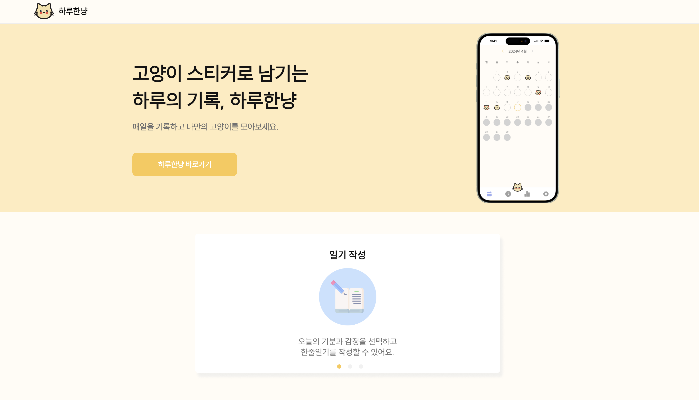

<br/>

<div align="center">
  
</div>

<h3 align="center">
    하루한냥 랜딩페이지
</h3>
<p align="center">
하루한냥 감정일기의 소개 페이지입니다.
<br/>
다양한 기능을 살펴보고, 서비스로 이동할 수 있습니다.  
</p>

<br />

<div align="center">
  
</div>

<br/><br />

## 배포 링크

### [https://haru-hannyan.vercel.app](https://haru-hannyan.vercel.app)

<br/><br/>

## 시작하기

### 설치 및 실행

```bash
git clone https://github.com/ShinjungOh/Haru-Hannyan-Landing
```

```bash
npm install
```

```bash
npm run dev
```

<br/><br/>

## 사용한 기술

<table>
  <tbody>
    <tr>
      <td align="center" valign="middle">
        <div>
          
          
          <p align="center">
            TypeScript
          <p>
        </div>
      </td>
      <td align="center" valign="middle">
        <div>
          
          
          <p align="center">
            React
          </p>
        </div>
      </td>
      <td align="center" valign="middle">
        <div>
          
          
          <p align="center">
            Next.js
          </P>
        </div>
      </td>
      <td align="center" valign="middle">
        <div>
          
          
          <p align="center">
            Vanilla-extract
          </p>
        </div>
      </td>
      <td align="center" valign="middle">
        <div>
          
           
          <p align="center">
            Framer Motion
          </p>
        </div>
      </td>
    </tr>
    <tr>
      <td align="center" valign="middle">
        <div>
          
          
          <p align="center">
            Git
          </p>
        </div>
      </td>
      <td align="center" valign="middle">
        <div>
          
          
          <p align="center">
            Husky
          </p>
        </div>
      </td>
      <td align="center" valign="middle">
        <div>
          
          
          <p align="center">
            Eslint
          </p>
        </div>
      </td>
      <td align="center" valign="middle">
        <div>
          
          
          <p align="center">
            Prettier
          </p>
        </div>
      </td>
    </tr>
  </tbody>
</table>

<br/>

<br/><br/>

## 개발하며 겪은 문제점

[🔗 [트러블 슈팅] 서버 사이드 렌더링(SSR)과 동적 스타일 문제 해결하기](https://shinjungoh.tistory.com/entry/%ED%8A%B8%EB%9F%AC%EB%B8%94-%EC%8A%88%ED%8C%85-%EC%84%9C%EB%B2%84-%EC%82%AC%EC%9D%B4%EB%93%9C-%EB%A0%8C%EB%8D%94%EB%A7%81SSR%EA%B3%BC-%EB%8F%99%EC%A0%81-%EC%8A%A4%ED%83%80%EC%9D%BC-%EB%AC%B8%EC%A0%9C-%ED%95%B4%EA%B2%B0%ED%95%98%EA%B8%B0)

### 1. 프로젝트를 진행하며 깨달은 점

랜딩 페이지는 사용자에게 한 눈에 어필해야하는 광고판으로 접근해야 한다.
많은 정보를 제공하면서도 지루하지 않도록 사용자 이펙트가 있어야 한다.
그렇기에 서버 사이드 렌더링으로 접근할 경우 많은 고려가 필요했다.  
사용자 기기의 크기를 측정해서 화면을 조정하는 반응형, 스크롤 이펙트 등을 SSR로 다루려면 미리 서버에서 만들어진 HTML을 내려주는 **SSR 방식을 능숙하게 사용할 줄 알아야 했다.**

### 2. 기술 선정과 개념 증명의 중요성

기획 단계에서, 기술 스택을 정하는 개념 증명 단계에서 더 깊게 생각하고 결정해야 했다.
사실은 쓰고 싶은 기술이 정해져 있고 이유는 가져다 붙인게 아니었는지 돌아보았다.
욕심내서 어려운 기술을 시도했다가 트러블 슈팅만 잔뜩 했고 프로젝트를 만들어나가는 재미는 줄어들었다.
결국 **동기부여 저하**로 이어졌다.

### 3. 렌더링 패턴에 따른 라이브러리 사용의 어려움

렌더링 패턴으로 인한 이슈를 겪고 나니 특히나 프로젝트에 SSR을 도입하려면 심사숙고해야겠다고 느꼈다.
클라이언트 컴포넌트에서만 사용할 수 있는 라이브러리가 따로 있었고, **클라이언트 컴포넌트와 서버 컴포넌트의 차이점을 계속 구분하면서 개발하는 것이 복잡**했다.
Next.js 환경 설정이 추가로 필요한 라이브러리도 있고(Vanilla-extract 등) 환경 세팅이 어려웠다.

대부분의 컴포넌트에 "use client"를 붙여 작업했기 때문에 CSR과 비교해 SSR의 장점을 가져가지 못했다.
서버 컴포넌트란 서버 사이드 렌더링과 무슨 관련이 있는지도 학습이 필요했다.
Vanilla-extract라는 새로운 스타일 라이브러리를 사용한 것도 문제가 됐다.
공통 컴포넌트를 사용해 동적 스타일링이 원활하게 적용되도록 recipes와 dynamic 등의 패키지도 사용해봤지만 오류가 계속되거나, 학습 곡선만 높아졌다.

### 4. 회고

SSR 렌더링 패턴에 대해 많이 깨져보고 얻는 것이 많았다.
다음에 프로젝트를 진행하게 되면 기술 스택부터 신중할 것이다.
**개념 증명은 남을 설득할 수 있을 만큼 자신에게 확신이 있어야겠다는 깨달음**을 얻었다.  
